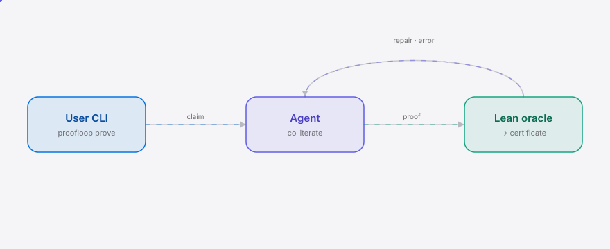
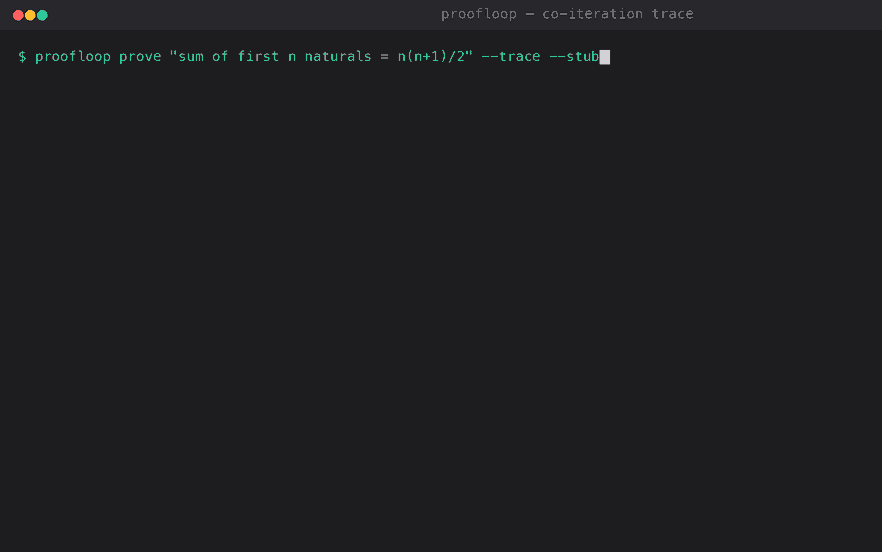

<div align="right"><sub><b>EN</b>&nbsp;&nbsp;⇄&nbsp;&nbsp;<a href="./README.md">中文</a></sub></div>

<picture>
  <source media="(prefers-color-scheme: dark)" srcset="./assets/hero-dark.svg">
  <source media="(prefers-color-scheme: light)" srcset="./assets/hero-light.svg">
  
</picture>

<p align="center"><sub>The math-coding agent for mathematicians — it emits code together with a machine-checkable Lean proof certificate.</sub></p>

<p align="center"><b>When the model says “proved” — who checks? ProofLoop treats Lean as a compiler: if the proof won’t type-check, it feeds the type error back to the agent and iterates until it does — attaching a machine-checkable certificate, not prose you have to trust.</b></p>

<p align="center">
  <a href="./LICENSE"></a>
  
  
  
</p>

<h2> Architecture</h2>

<picture>
  <source media="(prefers-color-scheme: dark)" srcset="./assets/atlas-dark.svg">
  <source media="(prefers-color-scheme: light)" srcset="./assets/atlas-light.svg">
  
</picture>

One Python process, two external dependencies: an OpenAI-compatible LLM endpoint and a Lean toolchain subprocess. No services, no daemons. `proofloop prove "<claim>"` has the agent draft **a Python implementation and a Lean 4 proof in one shot**, hands the proof to `lean` for type-checking — on success it emits a certificate, on failure it feeds Lean’s `stderr` back to the model for another draft, looping until it passes or the budget runs out. `proof_passed: true` is asserted only when `lean` exits 0.

<h2> Why this exists</h2>

Mathematicians and scientific-computing engineers who ask a general-purpose coding agent to write a numerical or symbolic routine get back plausible-looking code plus a prose “proof” — with no mechanism to tell correct derivation from hallucination. A general agent optimizes for breadth and natural-language plausibility; bolting on a Lean co-iteration loop has no value for its 95% of non-math users, and the failure mode (plausible-but-wrong math) is invisible to non-experts, so it never gets the signal to prioritize it.

ProofLoop turns that trust question into a mechanically decidable fact: the agent drafts a Lean proof, the Lean type-checker is the ground-truth oracle, and on failure it iterates. `proof_passed` in `certificate.json` is decided by `lean`’s exit code, never by the model grading itself — you can re-run `lean out.lean` yourself in two seconds.

> Contents: [Architecture](#architecture) · [Why this exists](#why-this-exists) · [Quickstart](#quickstart) · [Usage](#usage) · [Demo](#demo) · [Configuration](#configuration) · [Roadmap](#roadmap) · [License](#license)

<h2> Quickstart</h2>

Try the full co-iteration loop with zero config (no API key, no Lean):

```bash
uvx proofloop prove "sum of first n naturals = n(n+1)/2" --trace --stub
```

To run real proofs, install Lean 4 once and provide any OpenAI-compatible key (DeepSeek / GLM / Qwen / OpenAI all work):

```bash
elan default 4.10                # one-time Lean 4 toolchain (skip if installed)
export PROOFLOOP_API_KEY=sk-...  # any OpenAI-compatible key
proofloop prove "sum of first n naturals = n(n+1)/2" --trace
```

Both paths write `out.lean` (passes Lean), `out.py`, and `certificate.json` into the current directory.

<details>
<summary>Sample output (<code>--trace --stub</code>, converges in 2 iterations)</summary>

```json
{
  "claim": "sum of first n naturals = n(n+1)/2",
  "proof_passed": true,
  "lean_version": "lean 4 (stub)",
  "checked_at": "2026-08-21T20:04:01+00:00",
  "iterations": [
    { "lean_ok": false, "lean_stderr": "error: 'sorry' is not allowed — admitted goals are not proofs" },
    { "lean_ok": true,  "lean_stderr": "" }
  ]
}
```
</details>

<h2> Usage</h2>

```bash
# Real path: real LLM + real Lean; --trace renders every draft → error → repair step
proofloop prove "the sum of the first n naturals is n(n+1)/2" --trace

# Offline taste of the loop shape (bundled example, no key / no Lean)
proofloop prove "the sum of the first n naturals is n(n+1)/2" --trace --stub

# Pick the output directory and the iteration budget
proofloop prove "for all n, 2 * sumTo n = n*(n+1)" --out-dir proofs/ --max-iter 12

# Switch to DeepSeek: just change the endpoint and model
PROOFLOOP_BASE_URL=https://api.deepseek.com/v1 \
PROOFLOOP_MODEL=deepseek-chat \
proofloop prove "sum of first n naturals = n(n+1)/2" --trace
```

A full worked example lives in [`examples/`](./examples) (`sum_naturals.lean` + `sum_naturals.py`: the Lean proof and the Python implementation of the same claim).

<h2> Demo</h2>



Above is the `--stub` path: draft (with `sorry`) → Lean rejects → the `stderr` is fed back to the agent for a re-draft → type-checks → `certificate.json` shows `proof_passed: true`. `docs/demo.tape` is the [vhs](https://github.com/charmbracelet/vhs) script of that session; `.github/workflows/demo.yml` re-renders the real binary via vhs on demand.

<h2> Configuration</h2>

Everything is configured via environment variables (CLI flags `--model` / `--base-url` / `--lean` override them):

| Variable | Type | Default | Meaning |
| --- | --- | --- | --- |
| `PROOFLOOP_API_KEY` | str | — | OpenAI-compatible API key (falls back to `OPENAI_API_KEY`) |
| `PROOFLOOP_BASE_URL` | str | `https://api.openai.com/v1` | LLM endpoint (change for DeepSeek/GLM/Qwen) |
| `PROOFLOOP_MODEL` | str | `gpt-4o-mini` | Model name |
| `PROOFLOOP_LEAN` | str | `lean` | Path to the `lean` binary (set explicitly if not on PATH) |
| `PROOFLOOP_MAX_ITER` | int | `8` | Co-iteration attempt cap |
| `PROOFLOOP_OUT_DIR` | str | `.` | Output directory for `out.lean` / `out.py` / `certificate.json` |

<h2> Roadmap</h2>

- [x] **m1 — CLI**: `proofloop prove` co-iterates against Lean as the oracle until the proof type-checks, emitting `out.lean` / `out.py` / `certificate.json`; `--trace` renders each step.
- [ ] **m2 — hosted playground**: in-browser WASM Lean (lean4web), a 10-minute no-install demo with a shareable URL embedding the trace + certificate.
- [ ] **m3 — example library + convergence benchmark**: 10-20 curated classic theorems (induction basics, divisibility, small analysis) with known-good proofs + a success-rate / mean-iterations leaderboard.

v0.1 is a single linear retry loop only: no proof-search tree, no auto-formalization of arbitrary natural-language theorems, no formally-verified code↔proof bridge (the link is the shared claim). Full scope is in the repo issues.

<h2> License</h2>

MIT — see [LICENSE](./LICENSE). File bugs or claims you’d like to try in Issues; PRs should stay within the m1 scope.

> After pushing, set repo topics: `gh repo edit --add-topic lean --add-topic proof --add-topic formal-methods --add-topic agent`

<p align="center"><sub><a href="./LICENSE">MIT</a> © 2026 SuperMarioYL</sub></p>
