[简体中文](./README.md) · [Website](https://proofloop.lei6393.com) · [GitHub](https://github.com/SuperMarioYL/proofloop)

<picture>
  <source media="(max-width: 600px) and (prefers-color-scheme: dark)" srcset="./assets/presentation/hero-mobile-dark.svg">
  <source media="(max-width: 600px)" srcset="./assets/presentation/hero-mobile-light.svg">
  <source media="(prefers-color-scheme: dark)" srcset="./assets/presentation/hero-dark.svg">
  
</picture>

# ProofLoop

**Keep the proof attempts beside the generated code.**

ProofLoop asks a configured model for Python and Lean drafts, feeds checker errors back for repair, and saves the final sources with a record of each attempt.

## Why use it

A final answer hides how a proof was obtained and which check accepted it. Keeping draft, error and repair together makes the run inspectable and gives you the Lean source for independent checking.

- **Trace the repair** — Each attempt keeps its draft and checker error.
- **Retain proof source** — out.lean is available for independent checking.
- **Separate demo from real checks** — Model and checker labels remain in the certificate.

## Architecture

<picture>
  <source media="(max-width: 600px) and (prefers-color-scheme: dark)" srcset="./assets/presentation/architecture-mobile-dark.svg">
  <source media="(max-width: 600px)" srcset="./assets/presentation/architecture-mobile-light.svg">
  <source media="(prefers-color-scheme: dark)" srcset="./assets/presentation/architecture-dark.svg">
  
</picture>

The CLI resolves the model and checker. co_iterate parses fenced Python/Lean drafts, invokes the checker and asks for repair until success or the iteration cap. emit writes out.py, out.lean and certificate.json. --stub replaces both model and checker with bundled stand-ins.

| Component | Responsibility |
| --- | --- |
| `Claim + configuration` | src/proofloop/cli.py |
| `Draft / repair loop` | src/proofloop/agent.py |
| `Lean checker` | src/proofloop/lean.py |
| `Certificate files` | src/proofloop/certificate.py |

## Install and quickstart

Zero-config first look at the full co-iteration loop (no API key, no Lean, no clone):

```bash
uvx --from git+https://github.com/SuperMarioYL/proofloop proofloop prove "sum of the first n naturals = n(n+1)/2" --trace --stub
```

> Note: PyPI's `proofloop` name belongs to an unrelated project (no CLI) — always use the `--from git+...` form above to install this product.

Use the runtime version declared in the repository manifest. The source installation below makes the included example reproducible.

```bash
git clone https://github.com/SuperMarioYL/proofloop.git
cd proofloop
python3.12 -m venv .venv
source .venv/bin/activate
python -m pip install -e .
```

Python 3.12+; the included driver reads the three artifacts from a complete stub run in a temporary directory.

```bash
python3 examples/presentation_demo.py
```

## Recorded demo

<picture>
  <source media="(max-width: 600px) and (prefers-color-scheme: dark)" srcset="./assets/presentation/process-mobile-dark.svg">
  <source media="(max-width: 600px)" srcset="./assets/presentation/process-mobile-light.svg">
  <source media="(prefers-color-scheme: dark)" srcset="./assets/presentation/process-dark.svg">
  
</picture>

The stub records a rejected attempt followed by simulated acceptance, and writes out.py, out.lean and certificate.json.

```text
{
  "model": "demo (stub)",
  "checker": "lean 4 (stub)",
  "simulated_proof_passed": true,
  "iteration_results": [
    false,
    true
  ],
  "files": [
    "certificate.json",
    "out.lean",
    "out.py"
  ]
}
```

The complete command and output are recorded in [docs/demo-results.json](./docs/demo-results.json). Inputs and reproduction code are included in the repository.

## Usage

Run these commands from the repository root after installation. Replace paths for your own data.

```bash
proofloop prove "sum of the first n natural numbers" --stub --trace --out-dir demo-output
# Convergence benchmark over the bundled claims library (offline harness demo):
proofloop bench --stub --out-dir bench-output
# With a configured API key and Lean executable:
proofloop prove "sum of the first n natural numbers" --trace --max-iter 8 --out-dir proof-output
```

## Configuration

Set PROOFLOOP_API_KEY (or OPENAI_API_KEY), PROOFLOOP_BASE_URL, PROOFLOOP_MODEL, PROOFLOOP_LEAN, PROOFLOOP_MAX_ITER and PROOFLOOP_OUT_DIR for the real path; --base-url, --model, --lean, --max-iter and --out-dir override their environment settings. The real checker rejects sorry/admit text before invoking Lean and has a subprocess timeout. --stub needs neither key nor Lean.

## Integrations and responsibilities

<picture>
  <source media="(max-width: 600px) and (prefers-color-scheme: dark)" srcset="./assets/presentation/integrations-mobile-dark.svg">
  <source media="(max-width: 600px)" srcset="./assets/presentation/integrations-mobile-light.svg">
  <source media="(prefers-color-scheme: dark)" srcset="./assets/presentation/integrations-dark.svg">
  
</picture>

Choose the input and output route that matches your workflow. The local example below exercises the stated subset.

| Route | Implemented role |
| --- | --- |
| OpenAI-compatible API | Configured draft generation |
| Lean 4 executable | Real type-checking path |
| Stub backends | Offline workflow demonstration |
| Python / Lean files | Final generated sources |
| JSON certificate | Claim, checker and iteration record |

## Limits and next steps

- The demo checker passes any draft without sorry/admit. Its proof_passed flag is simulated and is not formal verification.
- Even a real Lean acceptance checks the Lean statement, not equivalence of the Python program or fidelity to the natural-language claim. Review theorem assumptions and generated code.
- The CLI writes a certificate on exhaustion and does not necessarily return a nonzero status for an unproved claim. Inspect proof_passed, model and lean_version.

Stronger code-to-theorem linkage, cross-model live convergence data and separately verified Lean environments remain useful next steps. As of v0.2 the repository ships a 10-theorem claims library ([examples/library.jsonl](./examples/library.jsonl), reference proofs machine-checked on Lean 4.10.0 at build time) and `proofloop bench` for per-run convergence leaderboards (leaderboard.json is generated per run; no LLM benchmark numbers are curated in the repo).

## License and contributions

See [LICENSE](./LICENSE). When reporting an issue, include a minimal input, the command, and the observed output.
